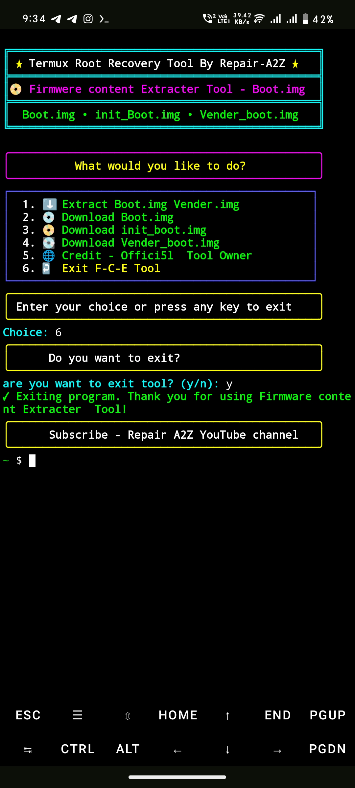

# Firmware-Content-Extracter
Download Boot.img, init_boot.img, vendor_boot.img without downloading flash file in simple steps

# installation :- 

```Install``` [termux](https://f-droid.org/repo/com.termux_1022.apk)
```apk```
```console
yes | pkg update && upgrade
```
```console
yes | pkg install git
```

# Installation Firmwere Content Extracter Tool :-

```console
git clone https://github.com/Ishu43642/Firmware-Content-Extracter.git
```

```console
cd Firmware-Content-Extracter
```
```console
chmod +x FCE2.sh
```

# Run Tool 

```console
./FCE2.sh
```

# Tool Feature 
1.⬇️ Download 💿 Boot.img Without downloading complete rom

2.👍 easy to use only copy past

3.📀 img File extract to telegram 📢channel

4. watch extracting process using 🌐link

# Credit :-
1. offici5l - for [Termux Firmware-Content-Extracter tool](https://github.com/offici5l/Firmware-Content-Extractor)

2. [Mahesh Verma](https://github.com/MaheshTechnicals) - For Ui Enhancement in my tool